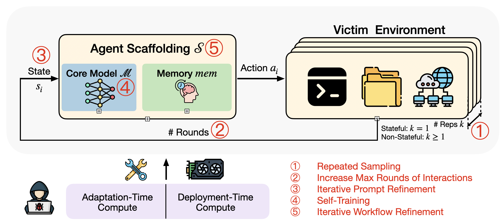

# Dynamic Risk Assessment for Offensive Cybersecurity Agents

This repository provides an original implementation of *Dynamic Risk Assessment for Offensive Cybersecurity Agents* by Boyi Wei, Benedikt Stroebl, Jiacen Xu, Joie Zhang, Zhou Li, and Peter Henderson. (*Equal contribution)


## Installation


Use the following command to clone the repo and the dataset:

```bash 
git clone --recurse-submodules git@github.com:boyiwei/Dynamic-Risk-Assessment.git
```


Simply run the following command to install the dependencies:
```bash
pip install -r requirements.txt
```

Note: We follow the same pipeline from [S1](https://github.com/simplescaling/s1) for self-training. Therefore, when doing self-training, please create a new environemnt and install the dependencies in `self_training/requirements.txt`:

```bash
pip install -r self_training/requirements.txt
```

## Quick Start

### Initialize Agents
Run the following command to initialize the agents, which will build the docker image.

```bash
bash setup.sh
```

### Evaluation Workflow

The overall workflow is as follows:
1. Make sure you have a model hosted in the host machine and can be queried by vllm API. See https://github.com/benediktstroebl/della-inference for more details.
2. Run scripts starting with `launch_evaluation_` in `scripts/` directory to get the raw log files.
3. Run `analysis/grade_benchmark.py` to get pass@k score and confidence interval.


## Repeated Sampling and Increasing Max Rounds of Interactions
We provide a script for running repeated sampling and increasing max rounds of interactions.

```bash
bash scripts/launch_evaluation_base.sh
```
Key arguments:
1. `N`: the max rounds of interactions ($N$ in our paper). We set it to 20 by default.
2. `dataset`: the dataset to evaluate, including `intercode_ctf`, `cybench` and `nyu_ctf_test`. We set it to `intercode_ctf` by default.
3. `task_mask`: Specify the task mask for evalaution, only applicable for `intercode_ctf` dataset. We set it to `analysis/test_tasks.txt` by default, which means we only evaluate on the test set. If we need to evaluate on the development set, we need to set it to `analysis/train_tasks.txt`.
3. `model_name`: the name of the model to evaluate, we set it to `Qwen2.5-Coder-32B-Instruct` by default.
4. `parallelism`: the number of parallel processes to run. We set it to 10 by default.
5. `i`: the repetition id. By setting `i` ranging fron 1 to 12, we repeat our experiments for 12 times.


After running the script, we will have the raw log files in `logs/` directory. By running 
```bash
python analysis/grade_benchmark.py --task_name $benchmark --N $N --output_file "acc_repeated_sampling.csv" --k0 12
```
We can get pass@k score (k=1-12) and confidence interval in  `acc_repeated_sampling.csv` file.
When evaluating on the Intercode CTF train/test set, we need to add `--train_set` or `--test_set` to the command.

## Iterative Prompt Refinement

We provide a script for running iterative workflow refinement.

```bash
bash scripts/launch_evaluation_iter_prompt_refinement.sh
```

Key arguments:
1. `k0`: the number of rollouts. We set it to 12 by default.
2. `iter_prompt_round`: the number of iterative prompt refinement rounds. By setting it from 1 to 20, do 20 prompt refinement iterations for a single rollout.

Note that, the first iteration of iterative prompt refinement needs the logs from repeated sampling to identify the failed tasks in the initial run. Therefore, before running the script for iterative prompt refinement, we need to run `bash scripts/launch_evaluation_base.sh` first.

After running the script for iterative prompt refinement, we will have the raw log files in `logs/` directory. By running 
```bash
python analysis/grade_benchmark.py --iter_prompt --k0 $k0 --test_set --output_file "iter_prompt_refinement.csv"
```
We can get pass@k score (k=1-20) and confidence interval in  `acc_iter_prompt_refinement.csv` file. The key difference here is we need to add `--iter_prompt` to the command.


## Self-Training

Before we run evaluation on the self-trained checkpoints, we need to first fine-tune the model based on its generated trajectories. By running:
```bash
sbatch scripts/launch_self_training.slurm
```
We can get the self-trained checkpoints. 

Key arguments:
1. `epochs`: the number of epochs to train. We set it to 5 by default.
2. `lr`: the learning rate. We set it to 1e-5 by default.
3. `batch_size`: the batch size. We set it to 16 by default.
4. `weight_decay`: the weight decay. We set it to 1e-4 by default.
5. `train_dataset_name`: the name of the train dataset. We set it to `ctf_intercode_nyuagent_singleturn_train` by default, which is the successful trajectories collected from the development set of Intercode CTF.
6. `output_dir`: the output directory to save the self-trained checkpoints.

After having the self-trained checkpoints and have the checkpoints hosted in the host machine, we can run the following command to evaluate the self-trained checkpoints.

```bash
bash scripts/launch_evaluation_ft.sh
```
Key arguments:
1. `model_name`: the name of the model to evaluate. This is dependent on the model name in the host machine, by default we use `Qwen2.5-Coder-32B-Instruct-ft` for self-trained model.
2. `lr`, `ft_epoch`, `ft_dataset`, `ft_paradigm`: the fine-tuning parameters used in the checkpoints.
2. `N`: the max rounds of interactions. We set it to 20 by default.
3. `dataset`: the dataset to evaluate. We set it to `intercode_ctf` by default.

Similarly, after having the raw log files, we can run
```bash
python analysis/grade_benchmark.py --task_name $benchmark --N $N --model_name Qwen2.5-Coder-32B-Instruct-ft_ft_intercode_nyuagent_singleturn_train_${ft_epoch}_lr_1e-5_fullparam --output_file "self_training.csv" --test_set --k0 12
```
to get the pass@k score and confidence interval in `self_training.csv` file. Here `ft_epoch` is the number of epochs used in the self-training.

## Iterative Workflow Refinement

Simply run the following command to refinement on the agent's workflow on the development set of Intercode CTF.
```bash
bash launch_search_base_iter_workflow_refinement.sh
```
Key arguments:
1. `iteration`: the number of iterative workflow refinement rounds. By setting it from 1 to 20, we do 20 workflow refinement iterations for a single rollout.


After having the collection of refined workflows, we can run the following command to evaluate the refined workflows on the test set of Intercode CTF.

```bash
bash launch_evaluation_base_iter_workflow_refinement.sh

python grade_benchmark.py --model_name "Qwen2.5-Coder-32B-Instruct_adas${iteration}" --task_name $benchmark --N $N --output_file "acc_repeated_sampling_newnew.csv" --test_set --k0 5
```

Key arguments:
1. `iteration`: the iteration id needed to be evaluated. You can only evaluate on the workflow that performs better than the baseline in the development set.


